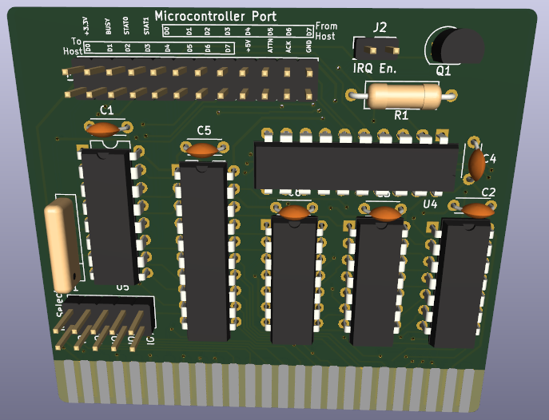

# X16-Simple-Intf

This is a proof of concept interface between the X16's 6502 bus and a modern microcontroller. This could be done much more simply with a CPLD, but in keeping with the "retro feel" of the X16, this was implement using all 74xx logic in a DIP package. 

Note: The X16 card edge in the design may be mirrored. Until this can be validated, use at your own risk!

## Host Software Operation

This interface contains two exposed memory addresses and three functional registers:

| Address | Name | Description |
| ------- | ---- | -------- |
| 0 | HOST_WR | Data byte from host to client, write only |
| 0 | HOST_RD | Data byte from client, read only |
| 1 | STATUS | Status flags for card and client, read only |

As can be seen from above, address 0 is used for both the read and write registers. The card only looks at the A0 address line which results in the HOST_XX registers appearing at all even addresses within the selected IO region and the STATUS register at all odd addresses.

The flags of the STATUS register are

| Bit | Name | Description |
| --- | ---- | ----------- |
| 0 | CSTAT_0 | Client status 0. This value reflects the state of the STAT_0 input pin from the client. Interpretation of the meaning of this flag is implementation dependent. |
| 1 | CSTAT_1 | Client status 1. This value reflects the state of the STAT_1 input pin from the client. Interpretation of the meaning of this flag is implementation dependent. |
| 2-5 | UNUSED | Unused status bits. Will contain the same values as the HOST_RD register. |
| 6 | BUSY | Client busy status. This bit indicates that the client has not yet acknowledged the last byte transmitted from the host. |
| 7 | ATTN | Attention. Indicates that the client is trying to get the host's attention. If jumper J2 on the card is closed, the /IRQ line will be held low (asserted) while ATTN is asserted. |

The position of the BUSY and ATTN flags is intended to allow the host software to determine their state via the `BIT` instruction.

## Microcontroller Interface Operation

The design exposes a total of 21 IO signals to a microcontroller. The direction below is specified relative to the card. "I" (Input) indicates a signal from the microcontroller to the card and "O" (Output) indicates a signal from the card to the microcontroller.

The IO signals are

| Pin | Function | Direction | Notes |
| -------- | ----------- | --- | --- |
| H_D0 - H_D7 | Host data | O | The last byte of data sent from the host. This byte is stored in a register and does not reflect the state of the 6502 data bus. |
| C_D0 - C_D7 | Client data | I | A byte of data sent from the microcontroller to the host.This byte is not stored in a register and should be maintained by the microcontroller until it is no longer needed (as determined by the implementation). |
| ATTN | Client attention | I | Should be set high by the microcontroller to indicate that it wants the host's attention. The pin state should be maintained by the microcontroller until host attention is no longer needed. |
| BUSY | Host attention | O | Indicates that the host has written a byte to the HOST_WR register that the microcontroller has not acknowledged. The card is reporting to the host that the microcontroller is busy. |
| ACK | Acknowledge | I | A strobe on this pin by the microcontroller will clear the BUSY signal. This pin should not be held high, asserting it for ~10ns is sufficient. |
| STAT_0 - STAT_1 | Status 0/1 | I | Implementation-dependent status signals. The state of these inputs can be read by the host in the CSTAT_0 and CSTAT_1 flags of the STATUS register. |
